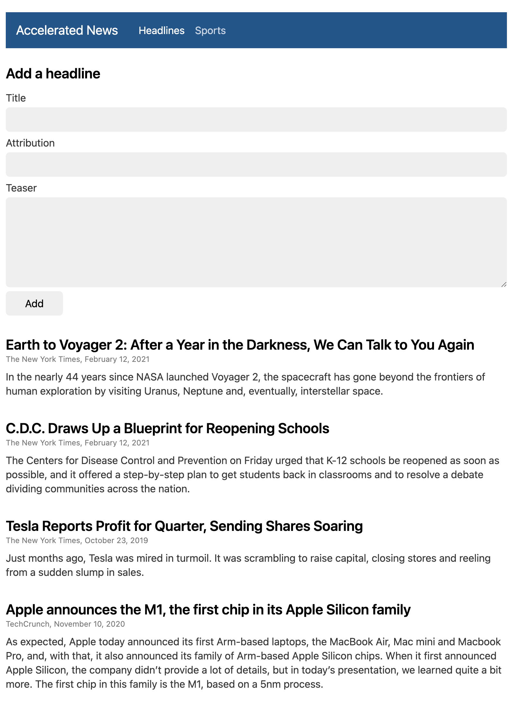
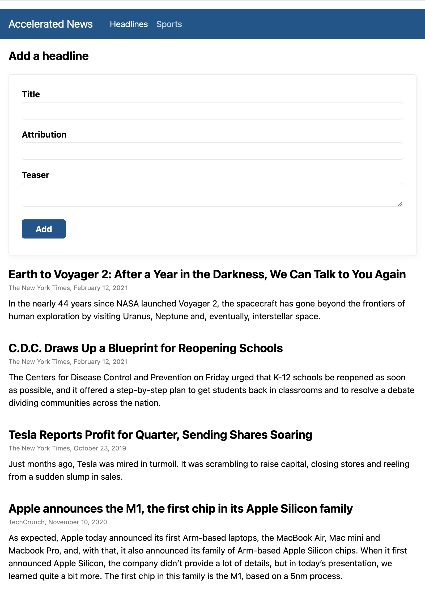
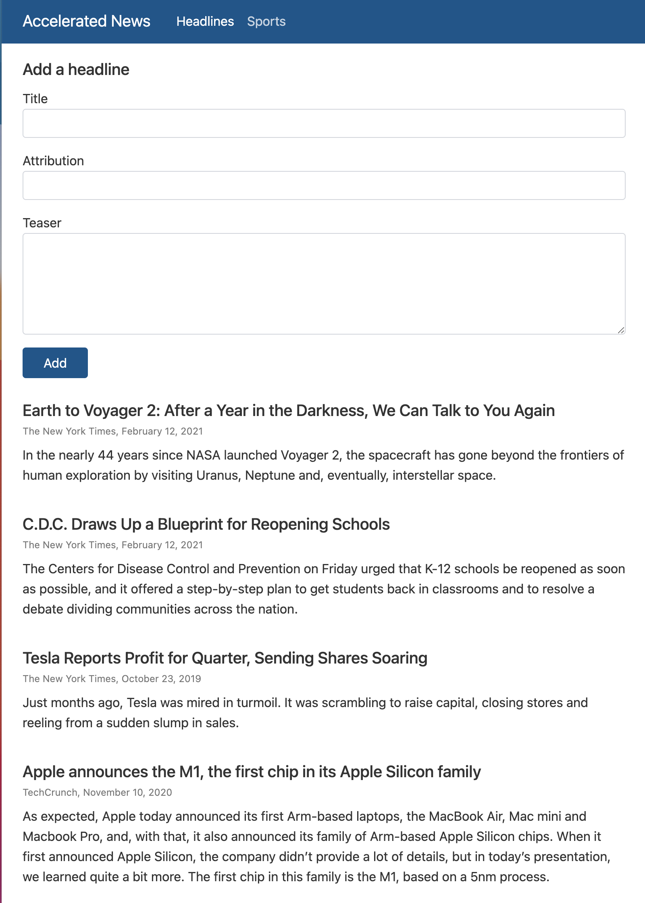

# CSS Framework Evaluation

### Criteria

1. Theming using CSS Variables
2. Nice typography
3. Form element styling

## Class-less

### Water.css

- [Home Page & Demo](https://watercss.kognise.dev/)
- [Theming](https://github.com/kognise/water.css#theming)
- Font Family: system-ui, -apple-system, ...
- Form Elements: yes

### MVP.css

- [Home Page](https://andybrewer.github.io/mvp/)
- [Demo](https://andybrewer.github.io/mvp/mvp.html)
- [Theming](https://github.com/andybrewer/mvp/blob/master/mvp.css)
- Font Family: -apple-system, BlinkMacSystemFont, ...
- Form Elements: yes

## Very Lightweight

### Chota

- [Home Page](https://jenil.github.io/chota/)
- [Demo](https://cdn.rawgit.com/jenil/chota/master/test/index.html)
- [Theming](https://jenil.github.io/chota/#customizing)
- [Base Styles](https://github.com/jenil/chota/blob/master/src/_base.css)
- Font Family: -apple-system, BlinkMacSystemFont, ...
- Form Elements: yes

